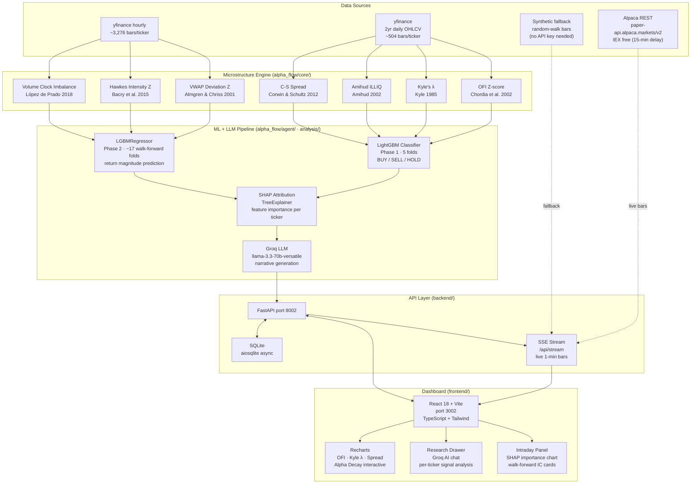
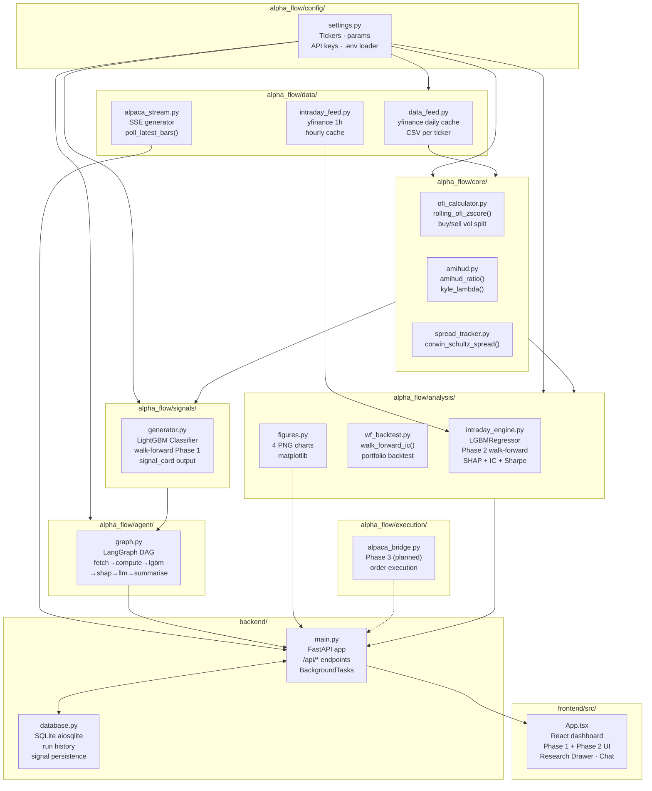

# AlphaFlow — System Architecture

Three levels of detail: high-level system layers, the Phase 2 ML pipeline DAG, and module-level file relationships.

All diagrams render in VS Code with the [Markdown Preview Mermaid Support](https://marketplace.visualstudio.com/items?itemName=bierner.markdown-mermaid) extension (`Ctrl+Shift+V`).

---

## Diagram A — High-Level System Architecture

Five layers from raw market data to the live React dashboard.

---

## Diagram B — Phase 2 LangGraph ML Pipeline DAG

The intraday engine runs as a LangGraph state machine. Each node is a pure function. The graph is compiled once at startup and invoked per `POST /api/intraday/run`.

```mermaid
graph LR
    A["fetch_data\nyfinance 1h bars\nAlpaca fallback"]
    B["compute_features\n12 signals:\nOFI·Kyle·Amihud·Spread\nVWAP·Hawkes·VolClock\n+ 4 lag returns"]
    C["lgbm_walk_forward\nLGBMRegressor\n200-bar train / 50-bar test\n~17 folds · no lookahead"]
    D["shap_attribute\nTreeExplainer\nper-fold feature importance\naggregated across folds"]
    E["llm_interpret\nGroq llama-3.3-70b\ntemp=0.2 · grounded in\nDB signals + IC values"]
    F["summarise\nSignal card build\nIC · Sharpe · Sortino\nMax DD · top SHAP feature"]
    G[("SQLite DB\nalpha_flow_intraday\nper-ticker rows")]
    H["/api/intraday/signals\nJSON → React dashboard"]

    A --> B --> C --> D --> E --> F --> G --> H

    style A fill:#0C4A6E,color:#A5F3FC
    style B fill:#0C4A6E,color:#A5F3FC
    style C fill:#1e3a5f,color:#7DD3FC
    style D fill:#1e3a5f,color:#7DD3FC
    style E fill:#3730A3,color:#C7D2FE
    style F fill:#1e3a5f,color:#7DD3FC
    style G fill:#064E3B,color:#6EE7B7
    style H fill:#064E3B,color:#6EE7B7
```

**Key design decisions:**
- Walk-forward (not k-fold) to prevent look-ahead bias in financial time series
- LGBMRegressor (not Classifier) for correct IC = Spearman(ŷ, y) measurement
- SHAP TreeExplainer runs at test-fold level to prevent train-set contamination
- LLM grounded in live DB data — not hallucinated signal descriptions

---

## Diagram C — Module-Level File Architecture

Internal dependencies within `alpha_flow/` and how they connect to the backend and frontend.

---

## Export for Scholarship Applications

To export as PDF for scholarship or JPM application:

1. Open `architecture.drawio` at [diagrams.net](https://app.diagrams.net) (File → Open → upload the file)
2. Select all (Ctrl+A) → File → Export As → PDF
3. Tick "Fit Page" and "Border Width: 10"
4. Save as `AlphaFlow_Architecture.pdf`

The draw.io file contains Diagram A (high-level) as a polished version suitable for non-technical reviewers.
