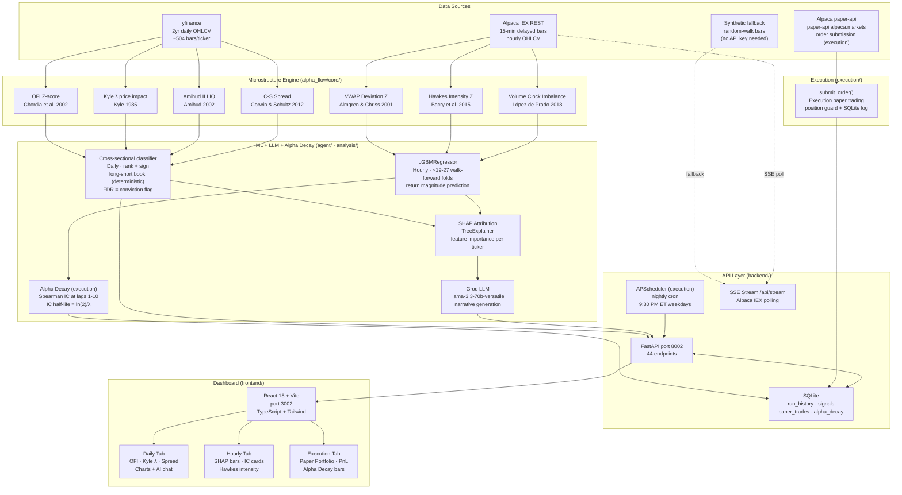
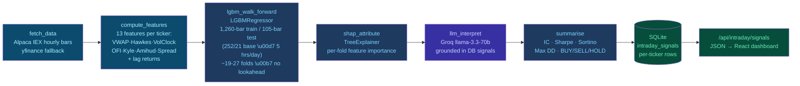
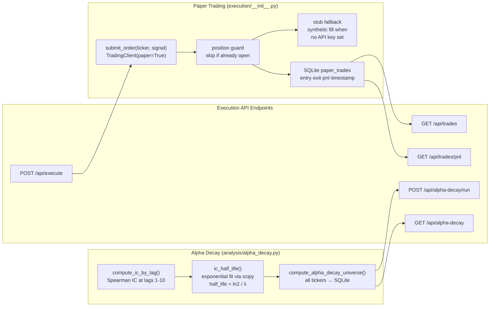
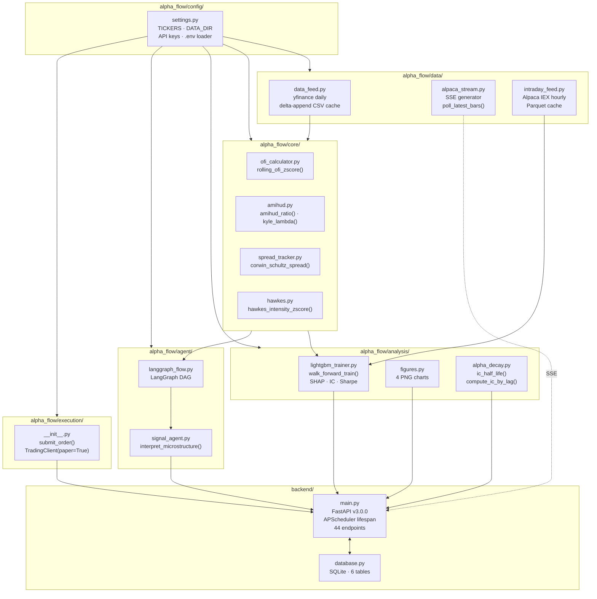

# AlphaFlow — System Architecture v3.0

Complete technical reference for the daily + hourly + execution layers. Covers system layers, ML pipeline DAG, module dependencies, data flow, and learning resources.

All Mermaid diagrams render in VS Code with the [Markdown Preview Mermaid Support](https://marketplace.visualstudio.com/items?itemName=bierner.markdown-mermaid) extension (`Ctrl+Shift+V` to preview).

---

## What Each Layer Adds

| Layer | Key capability | Files |
|-------|-------------|-------|
| Daily | Daily OFI/Kyle/Amihud/CS-Spread signals, deterministic cross-sectional rank + sign (long-short book; FDR = conviction flag), Groq LLM narrative, React dashboard | `core/`, `agent/langgraph_flow.py`, `backend/main.py` |
| Hourly | Hourly bars via Alpaca IEX, 8 new features, LGBMRegressor walk-forward, SHAP attribution, live SSE stream | `data/intraday_feed.py`, `analysis/intraday_engine.py`, `data/alpaca_stream.py` |
| Execution | Paper trading orders, alpha decay IC half-life, APScheduler nightly cron, Render.com deploy, SQLite persistence | `execution/__init__.py`, `analysis/alpha_decay.py`, `render.yaml`, `backend/database.py` |
| Hardening | Embargo/purge gap in walk-forward, IC/Sharpe/HitRate SEM, Kyle's Lambda variance-floor fix, Corwin-Schultz smoothing disclosure, SignalFilterPills, mobile-responsive layout | `analysis/intraday_engine.py`, `backend/database.py`, `frontend/src/App.tsx` |

---

## Diagram A — High-Level System Architecture

Five layers from raw market data to the live React dashboard.



---

## Diagram B — Hourly LightGBM Pipeline DAG

The intraday engine runs as a LangGraph state machine. Each node is a pure function. Compiled once at FastAPI startup, invoked per `POST /api/intraday/run`.



**Key design decisions:**
- **Walk-forward (not k-fold)**: each test fold only sees past data → eliminates look-ahead bias
- **LGBMRegressor not Classifier**: predicts return magnitude; signal direction = cross-sectional rank → correct IC measurement
- **SHAP at test-fold level**: prevents train-set contamination in feature attribution
- **LLM grounded in DB**: Groq receives actual IC values and signal data — not hallucinating descriptions

---

## Diagram C — Execution + Alpha Decay Flow



**Alpha decay intuition:** IC(lag) = Spearman correlation between today's signal and the return `lag` bars ahead. Half-life = number of bars until IC drops to IC₀/2. A half-life of 2–3 hourly bars means the alpha persists for 2–3 hours — a comfortable TWAP execution window.

---

## Diagram D — Module-Level File Dependencies



---

## SQLite Schema (6 Tables)

```sql
-- daily run history
run_history           (id, started_at, finished_at, status, error_msg,
                       sharpe, max_drawdown, sortino, data_start, data_end, total_bars)
microstructure_signals(id, run_id, recorded_at, ticker, ofi, kyle_lambda,
                       amihud_illiq, eff_spread_bps, signal, llm_reason,
                       ic_value, lgbm_prob, sharpe)
-- hourly
shap_importance       (id, saved_at, ticker, mean_ic, feature, importance)
intraday_signals      (id, saved_at, ticker, signal, mean_ic, sharpe, sortino,
                       max_drawdown, n_folds, n_bars, train_bars, test_bars,
                       data_start, data_end, shap_top, last_features,
                       equity_curve_json, ic_per_fold_json,
                       -- tearsheet: ic_ir, ic_tstat, ic_pvalue, calmar, omega,
                       --          hit_rate, profit_factor
                       -- this revision: ic_sem, sharpe_sem, hit_rate_sem)
-- execution
paper_trades          (id, ticker, signal, qty, order_id, status,
                       filled_price, submitted_at, filled_at)
alpha_decay           (id, computed_at, ticker, half_life_bars, ic_by_lag_json,
                       half_life_ci_5, half_life_ci_95)
```

All tables are created via `CREATE TABLE IF NOT EXISTS` in `init_db()`; new columns are added non-destructively via `_migrate_columns()` (idempotent `ALTER TABLE`), so existing local/deployed databases upgrade in place without data loss.

On Render.com: `DATA_DIR=/var/data` overrides the SQLite path to `/var/data/app.db` (persists across deploys on mounted disk).

---

## API Endpoint Reference (44 endpoints)

| Method | Path | Phase | Description |
|--------|------|-------|-------------|
| GET | `/health` | All | Health check + Alpaca config status |
| GET | `/api/info` | All | Build/version info |
| POST | `/api/run` | 1 | Run full daily LangGraph pipeline |
| GET | `/api/run` | 1 | Pipeline run status |
| POST | `/api/data/refresh` | 1+2 | Refresh data + auto-run intraday pipeline |
| GET | `/api/history` | 1 | Run history (last N records) |
| GET | `/api/signals` | 1 | Latest microstructure signals |
| GET | `/api/signals/all` | 1 | All microstructure signals |
| GET | `/api/history/{run_id}/signals` | 1 | Signals for a specific historical run |
| GET | `/api/outputs` | 1 | List available chart/output files |
| GET | `/api/outputs/{filename}` | 1 | Serve PNG/JSON chart outputs |
| GET | `/api/data/{ticker}/csv` | 1 | Raw OHLCV CSV for a ticker |
| POST | `/api/tickers/add` | 1 | Add custom ticker (yfinance validation) |
| GET | `/api/tickers` | 1 | List active tickers |
| DELETE | `/api/tickers/{ticker}` | 1 | Remove a custom ticker |
| GET | `/api/data/execution-quality` | 1 | Effective spread / execution quality series |
| GET | `/api/data/kyle-lambda` | 1 | Kyle's Lambda time series |
| GET | `/api/data/alpha-decay` | 3 | Retrieve alpha decay results |
| GET | `/api/data/ofi-timeseries` | 1 | OFI z-score time series |
| POST | `/api/explain` | 1 | Per-ticker SHAP + LLM explanation |
| POST | `/api/chat` | 1 | Groq AI chat |
| POST | `/api/intraday/run` | 2 | Run hourly intraday walk-forward pipeline |
| GET | `/api/intraday/signals` | 2 | Hourly results (IC, Sharpe, SEM, signals) |
| GET | `/api/data/shap-importance` | 2 | SHAP importance for a ticker |
| GET | `/api/stream` | 2 | SSE live Alpaca bar stream |
| POST | `/api/execute` | 3 | Submit paper trades for BUY/SELL signals |
| GET | `/api/trades` | 3 | List all paper trades |
| GET | `/api/trades/pnl` | 3 | Aggregate PnL summary |
| DELETE | `/api/trades/all` | 3 | Clear all paper trades |
| DELETE | `/api/trades/pending` | 3 | Cancel pending paper trades |
| POST | `/api/alpha-decay/run` | 3 | Compute IC decay for all tickers |
| GET | `/api/alpha-decay` | 3 | Retrieve alpha decay results (run-scoped) |
| GET | `/api/intraday/hawkes` | 2 | Hawkes intensity chart series |
| GET | `/api/intraday/vwap` | 2 | VWAP z-score chart series |
| GET | `/api/intraday/vpin` | 3 | VPIN z-score chart series |
| GET | `/api/intraday/feature-correlation` | 2 | 13×13 feature Spearman correlation matrix |
| GET | `/api/intraday/lgbm-scatter` | 2 | Predicted vs. actual return scatter |
| GET | `/api/intraday/equity-curve` | 2 | Cumulative walk-forward equity curve |
| GET | `/api/portfolio/simulate` | 3 | Portfolio-level PnL simulation |
| GET | `/api/intraday/shap-dependence` | 2 | SHAP dependence plot data for a feature |

> Note: `/api/data/alpha-decay` (tag `data`) and `/api/alpha-decay` (tag `alpha_decay`) are two distinct, separately-implemented endpoints with overlapping names — the former reads persisted results, the latter is scoped to the most recent `/api/alpha-decay/run` invocation.

---

## Development Commands

```bash
# Backend
cd AlphaFlow && source .venv/bin/activate
uvicorn backend.main:app --reload --port 8002

# Frontend (separate terminal)
cd AlphaFlow/frontend && npm run dev -- --port 3002

# Run all 111 tests
cd AlphaFlow && source .venv/bin/activate && python -m pytest tests/ -q

# TypeScript type check (must be clean)
cd AlphaFlow/frontend && npm run build
```

---

## Learning Resources

### Why Walk-Forward?
Standard k-fold randomly shuffles data, creating look-ahead bias. Walk-forward always trains on the past and tests on the future. Reference: López de Prado (2018) Ch. 7 — https://www.wiley.com/en-us/Advances+in+Financial+Machine+Learning-p-9781119482086

### Why LGBMRegressor for IC?
IC = Spearman(predicted, actual). A Classifier produces {0,1} — you can't compute IC on binary labels. A Regressor predicts return magnitudes, which can be ranked cross-sectionally: top 20% = BUY. Industry standard at AQR, Two Sigma. Reference: Grinold & Kahn (2000) Ch. 6.

### Why Hawkes for Institutional Detection?
Hawkes processes model self-exciting arrivals: each large trade increases the probability of further large trades (institutional iceberg orders). The `hawkes_z()` score normalises intensity — z > 2 = unusual clustering. Reference: Bacry et al. (2015) https://arxiv.org/abs/1502.04592

### Why SHAP TreeExplainer?
SHAP decomposes each prediction into per-feature contributions using Shapley values from cooperative game theory. For LightGBM it is exact (not approximate). Essential for EU AI Act explainability. Reference: Lundberg & Lee (2017) https://arxiv.org/abs/1705.07874

### Why SSE (not WebSocket) for live stream?
SSE is one-directional (server → client), works over HTTP/1.1, reconnects automatically, native browser support. WebSocket adds bidirectional complexity with no benefit for read-only market data. FastAPI docs: https://fastapi.tiangolo.com/advanced/custom-response/

### Recommended Videos
- López de Prado lectures on ML in Finance: https://www.youtube.com/watch?v=VFZ4Fh8SHU4
- Quantopian Lecture Series (archived): https://gist.github.com/ih2502mk/50d8f7feb614c8676383431b056f4291
- Patrick Boyle on Market Microstructure: https://www.youtube.com/@PBoyle
- Algorithmic Trading with Alpaca API: https://www.youtube.com/watch?v=xfzGZB4HhEE

---

## Related Docs

| Document | Purpose |
|----------|---------|
| [ROADMAP.md](ROADMAP.md) | Completed phases + future upgrade plan with costs and IC estimates |
| [APPLICATION.md](APPLICATION.md) | Scholarship / personal narrative |
| [AlphaFlow_Executive_Brief.html](AlphaFlow_Executive_Brief.html) | Manager-facing PDF brief (open in browser → Print → Save as PDF) |
| [../notebooks/reproduce.ipynb](../notebooks/reproduce.ipynb) | Reproduces every RESEARCH.md number from raw data |

## Diagrams

All diagrams here are Mermaid (versioned as text — no binary source to drift).
For a single high-level current-state diagram see
[architecture-diagram.md](architecture-diagram.md). To export any diagram to PDF,
paste the Mermaid block into https://mermaid.live and use its PDF/SVG export.

