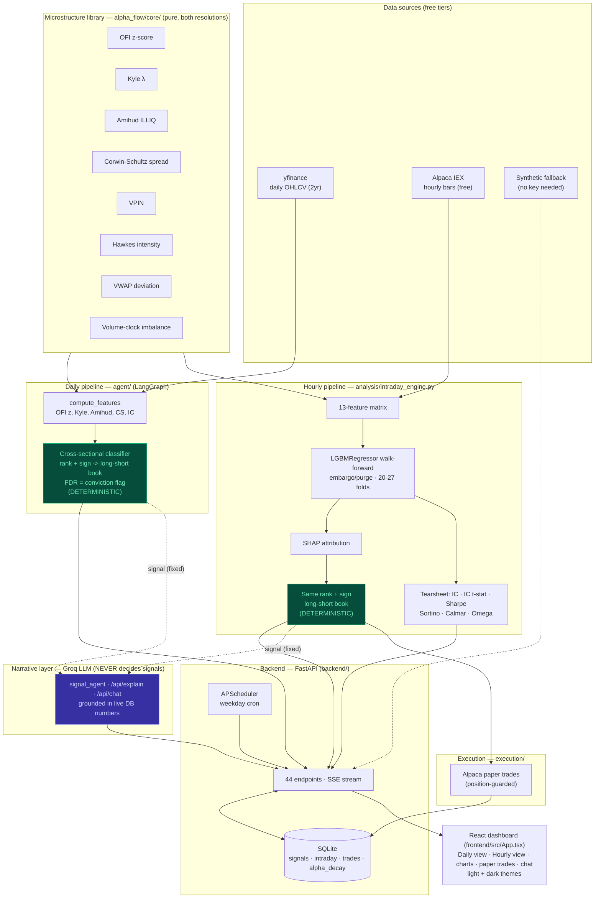

# AlphaFlow — Architecture Diagram (current state)

Single canonical current-state diagram. Renders on GitHub and in VS Code
(Markdown Preview Mermaid Support). For the detailed multi-diagram reference
(pipeline DAGs, DB schema, endpoint table) see [ARCHITECTURE.md](ARCHITECTURE.md).

**Reading the diagram:** the two green nodes are the *only* places a BUY/SELL/HOLD
is decided — both deterministic (cross-sectional rank → long-short book, with a
separate Benjamini-Hochberg FDR high-conviction flag; shared code in
`analysis/signal_classification.py`). The purple node (Groq
LLM) receives the already-decided signal and writes an explanation; it is never
upstream of a trading decision.
